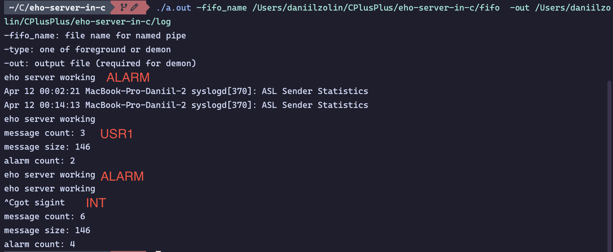

# eho-server-in-c
Эхо сервер на Си

Пример работы:

Раз в `n` секунд отправляется сигнал `ALARM`, обработчик которого выводит `eho server working`.

Также тестируются команды:

```bash
$ kill -USR1 42
$ kill -INT 42
```



Тестируется команда:

```bash
$ kill -9 42
```


Выполняется следующая команда:

```bash
$ kill -QUIT 42
```

Как видно на картинке, ничего не происходит, как и должно быть по заданию.

Далее тестируется обработка сигнала `SIGTERM`.


В следующем примере тестируется закрытие терминала (сигнал `SIGHUP`).


